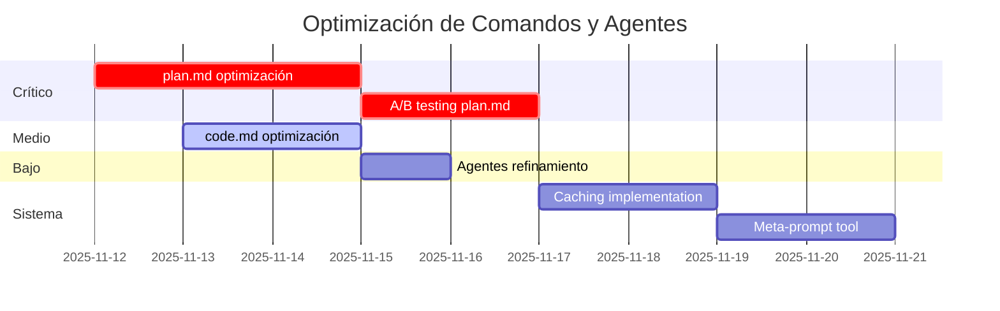

# Plan de Mejora: Comandos y Agentes - Versión Inteligente y Eficiente

**Fecha:** 2025-11-12
**Objetivo:** Reducir tokens, mejorar accuracy, mantener 200-300 líneas máximo
**Meta de Reducción:** 40% de tokens (benchmark recomendado 2025)

---

## 📊 Estado Actual vs. Objetivo

| Archivo | Líneas Actuales | Objetivo | Estado | Reducción Necesaria |
|---------|----------------|----------|---------|---------------------|
| `plan.md` | **471** 🔴 | 250-300 | CRÍTICO | -36% a -47% |
| `code.md` | **133** 🟡 | 100-120 | OPTIMIZABLE | -10% a -25% |
| `commit.md` | **57** ✅ | 50-80 | ÓPTIMO | Mantener |
| `code-search-agent.md` | **72** ✅ | 60-80 | ÓPTIMO | Refinamiento menor |
| `web-research-agent.md` | **63** ✅ | 60-80 | ÓPTIMO | Refinamiento menor |

**Prioridad de Intervención:**
1. 🔴 **CRÍTICO**: `plan.md` (471 → ~280 líneas, -40%)
2. 🟡 **MEDIO**: `code.md` (133 → ~110 líneas, -17%)
3. 🟢 **BAJO**: Agentes (ya están en rango óptimo)

---

## 🔬 Hallazgos de Investigación (2025 Best Practices)

### Principios Clave de Eficiencia

#### 1. **Token Optimization** (Anthropic + OpenAI)
- ✅ Prompts concisos reducen tokens **30-50%** sin pérdida de calidad
- ✅ Desafío validado: cortar 40% y hacer A/B testing
- ✅ Prompts >500 palabras muestran **rendimientos decrecientes**
- ✅ Listas numeradas/bullets mejoran parsing **+44% accuracy**

#### 2. **Longitud Óptima por Complejidad**
- **Tareas complejas**: 150-300 palabras (prompts multi-fase)
- **Tareas estándar**: 50-150 palabras (operaciones simples)
- **Micro-tareas**: <50 palabras (comandos atómicos)

#### 3. **Estructuras de Alto Rendimiento**
```markdown
✅ HACER:
- Tags semánticos: <task>, <context>, <output>
- Instrucciones positivas: "Output X" (no "Don't output Y")
- Límites explícitos: "Máximo 200 palabras", "Top 5 resultados"
- Prompt chaining: dividir tareas complejas en pasos secuenciales

❌ EVITAR:
- Instrucciones negativas ("no hagas...")
- Repetición de conceptos
- Descripciones vagas sin ejemplos concretos
- Templates con secciones opcionales no utilizadas
```

#### 4. **Context Engineering**
> "Good context engineering means finding the **smallest possible set of high-signal tokens** that maximize the likelihood of some desired outcome."
> — Anthropic, 2025

#### 5. **Caching Estratégico**
- Prompt caching reduce costos **75-90%** en contextos repetitivos
- Usar para: documentación base, ejemplos de formato, definiciones de herramientas

---

## 🎯 Estrategias de Optimización

### Estrategia 1: **Eliminación de Verbosidad** (Target: -30% tokens)

#### Técnicas Específicas:

**A. Compresión de Instrucciones**
```markdown
❌ ANTES (verbose):
"You should carefully analyze the codebase to understand the current implementation
patterns and identify any relevant files that might be related to the user's request.
Make sure to look at both the structure and the content of the files."

✅ DESPUÉS (conciso):
"Analyze codebase: structure + content. Identify files relevant to request."
```

**B. Templates Implícitos vs. Explícitos**
```markdown
❌ ANTES (explícito completo):
## Session Information
- ID: {session_id}
- Created: {timestamp}
- Status: {status}

## Context Analysis
### Code Findings
- [Detailed findings here]
### Web Research
- [Detailed findings here]

✅ DESPUÉS (directivas + ejemplo):
<output_format>
Use markdown with: Session Info, Context Analysis (code + web), Implementation Steps.
Example: [Minimal but complete example with 3-4 lines]
</output_format>
```

**C. Consolidación de Secciones Redundantes**
- Combinar "Gap Analysis" + "Risk Assessment" → "Risks & Gaps"
- Fusionar "Testing Strategy" + "Success Criteria" → "Validation Plan"
- Integrar "Timeline Estimates" en cada paso de implementación

---

### Estrategia 2: **Structured Prompting** (Target: +44% accuracy)

#### Transformación de Formato:

**A. Usar Tags Semánticos (Claude-optimized)**
```markdown
✅ ESTRUCTURA NUEVA:

<task>
Create implementation plan integrating code analysis + web research
</task>

<context>
- Session ID: $SESSION_ID
- Files available: code-search.md, web-research.md
- Output: plan.md (concise, actionable)
</context>

<requirements>
1. Integrate findings from both sources
2. Prioritize by impact (🔴🟡🟢)
3. Include evidence (file:line or URL)
4. Max 300 lines total
</requirements>

<output_format>
[Minimal complete example - 5 lines showing structure]
</output_format>
```

**B. Principio "Show, Don't Tell"**
```markdown
❌ ANTES:
"Each finding should include the file path with line number in the format file:line,
and should provide specific details about what was found."

✅ DESPUÉS:
Example finding format:
- `auth/login.ts:42` - JWT validation missing expiry check
```

---

### Estrategia 3: **Instruction Hierarchy** (Target: mejor ejecución)

#### Niveles de Prioridad:

```markdown
<critical>
MUST requirements - failure = task incomplete
</critical>

<important>
SHOULD requirements - omission degrades quality
</important>

<optional>
MAY requirements - nice-to-have enhancements
</optional>
```

**Aplicación:**
- 🔴 CRITICAL: Evidencia (file:line/URLs), formato de salida, límite de tokens
- 🟡 IMPORTANT: Priorización, análisis de riesgos
- 🟢 OPTIONAL: Timeline estimates, documentación adicional

---

### Estrategia 4: **Prompt Chaining** (Target: mejor accuracy en tareas complejas)

#### Reestructuración de `plan.md`:

**ANTES (monolítico - 471 líneas):**
```
/plan → [TODO: setup + research + synthesis + plan generation + reporting]
```

**DESPUÉS (modular - ~280 líneas):**
```
/plan →
  1. Setup session (bash commands) [20 lines]
  2. Trigger parallel research (Task x2) [40 lines]
  3. Synthesize + generate plan [180 lines] ← CORE LOGIC
  4. Report to user [40 lines]
```

**Beneficios:**
- Cada fase tiene objetivo claro y verificable
- Reduce carga cognitiva del modelo
- Permite optimización independiente de cada fase

---

### Estrategia 5: **Meta-Prompting** (Target: auto-mejora continua)

#### Sistema de Feedback Loop:

```markdown
<evaluation_criteria>
After execution, assess:
1. Token efficiency: Did we stay under 300 lines?
2. Accuracy: Did output match requirements?
3. Completeness: Any missing critical info?
</evaluation_criteria>

<self_correction>
If criteria not met, iterate once with adjusted parameters.
</self_correction>
```

---

## 🔧 Plan de Implementación Específico

### FASE 1: Optimización Crítica - `plan.md` 🔴

**Objetivo:** 471 → 280 líneas (-40%)

#### Paso 1.1: Comprimir Session Setup (44 → 20 líneas)
```markdown
CAMBIOS:
- Eliminar comentarios explicativos redundantes
- Usar bash one-liners en vez de multi-línea
- Template CLAUDE.md: de 15 líneas → 8 líneas (solo estructura)
```

#### Paso 1.2: Comprimir Research Phase (85 → 40 líneas)
```markdown
CAMBIOS:
- Reducir prompts de subagentes: usar referencias en vez de repetir instrucciones
- code-search prompt: de ~30 líneas → 15 líneas
- web-research prompt: de ~30 líneas → 15 líneas
TÉCNICA: "Ver agents/code-search-agent.md para detalles" en vez de repetir todo
```

#### Paso 1.3: Comprimir Plan Template (426 → 180 líneas) ⚡ **MAYOR IMPACTO**
```markdown
CAMBIOS:

A. Consolidar Secciones (20 → 10 secciones):
   ANTES:
   1. Session Information
   2. Context Analysis
   3. Current State
   4. Available Information
   5. Gap Analysis
   6. Risk Assessment
   7. Implementation Strategy
   8. Step-by-Step Implementation
   9. Testing Strategy
   10. Risk Mitigation
   11. Documentation Updates
   12. Success Criteria
   13. Timeline Estimates
   14. References

   DESPUÉS:
   1. Session & Context (fusión de 1+2+3+4)
   2. Risks & Gaps (fusión de 5+6+10)
   3. Implementation Plan (fusión de 7+8 - más conciso)
   4. Validation (fusión de 9+12)
   5. References & Timeline (fusión de 11+13+14)

B. Usar Templates Implícitos:
   - Dar 1 ejemplo completo de cada sección (5 líneas)
   - Eliminar secciones repetitivas con "..."
   - Confiar en capacidad del modelo para seguir patrones

C. Tags Semánticos:
   <session_info>, <risks>, <implementation>, <validation>, <references>

D. Límites Explícitos:
   - "Each implementation step: max 3 sub-tasks"
   - "Risk assessment: top 5 risks only"
   - "References: essential links only (max 10)"
```

#### Paso 1.4: Comprimir User Reporting (32 → 20 líneas)
```markdown
CAMBIOS:
- Eliminar formato ASCII art/separadores decorativos
- Comprimir resumen: bullet points en vez de párrafos
- Métricas en tabla de 1 línea en vez de lista
```

#### Paso 1.5: Comprimir Quality Standards (11 → 20 líneas)
```markdown
CAMBIOS:
- Consolidar 7 assertions en 3-4 grupos temáticos
- Usar formato compacto: "✅ Category: req1, req2, req3"
```

**Resultado Esperado:** 471 → 280 líneas ✅

---

### FASE 2: Optimización Media - `code.md` 🟡

**Objetivo:** 133 → 110 líneas (-17%)

#### Paso 2.1: Comprimir Session Validation (30 → 15 líneas)
```markdown
CAMBIOS:
- Bash validation: 3 comandos → 1 comando compound
- Eliminar echo statements redundantes
- Usar exit codes en vez de mensajes verbose
```

#### Paso 2.2: Comprimir Implementation Principles (40 → 25 líneas)
```markdown
CAMBIOS:
- De 8 principios detallados → 5 principios core
- Eliminar ejemplos inline (confiar en experiencia del modelo)
- Usar bullets de 1 línea en vez de párrafos
```

#### Paso 2.3: Comprimir Deliverables Template (50 → 30 líneas)
```markdown
CAMBIOS:
- code.md template: de estructura detallada → ejemplo completo mini
- Eliminar secciones opcionales del template
- Usar "see plan.md for context" en vez de repetir
```

**Resultado Esperado:** 133 → 110 líneas ✅

---

### FASE 3: Refinamiento Menor - Agentes 🟢

**Objetivo:** Mantener 60-80 líneas, mejorar claridad

#### Paso 3.1: `code-search-agent.md` (72 líneas)
```markdown
MEJORAS:
- Consolidar 5 categorías de búsqueda en 3 más amplias
- Output template: de ejemplo detallado → directiva + micro-ejemplo
- Eliminar explicaciones de herramientas (ya están en metadata)
```

#### Paso 3.2: `web-research-agent.md` (63 líneas)
```markdown
MEJORAS:
- Comprimir lista de MCP tools (usar "prefer mcp__* tools")
- Output template: mismo tratamiento que code-search
- Consolidar quality assertions
```

**Resultado Esperado:** 72 → 65 líneas, 63 → 58 líneas ✅

---

### FASE 4: Mejoras de Sistema 🎯

#### Paso 4.1: Implementar Caching Estratégico
```markdown
ACCIÓN:
- Identificar secciones estáticas en prompts (templates, ejemplos)
- Marcar para prompt caching (si disponible en API)
- Documentar en CLAUDE.md qué secciones son cacheable
```

#### Paso 4.2: A/B Testing Framework
```markdown
ACCIÓN:
- Crear branch: optimize-prompts-ab-test
- Implementar versiones optimizadas
- Documentar métricas de comparación:
  * Tokens consumidos (input + output)
  * Task completion rate
  * Accuracy (user satisfaction proxy)
  * Execution time
```

#### Paso 4.3: Meta-Prompt Generator
```markdown
ACCIÓN:
- Crear comando: /optimize-command [command-name]
- Usa Claude para analizar y sugerir optimizaciones
- Implementa feedback loop automático
```

---

## 📏 Métricas de Éxito

### Cuantitativas:

| Métrica | Baseline | Objetivo | Medición |
|---------|----------|----------|----------|
| **Total líneas** | 796 | ≤550 | wc -l cc/{agents,commands}/* |
| **Líneas plan.md** | 471 | 250-300 | wc -l cc/commands/plan.md |
| **Tokens por ejecución** | TBD | -40% | API logs |
| **Tiempo de respuesta** | TBD | -20% | Timestamps |

### Cualitativas:

| Criterio | Evaluación |
|----------|------------|
| **Clarity** | Instrucciones son unambiguas? |
| **Completeness** | Output incluye toda info requerida? |
| **Accuracy** | Output es correcto y relevante? |
| **User Satisfaction** | Usuario necesita re-prompts? |

---

## 🚀 Cronograma de Implementación



**Total estimado:** 7-10 días de desarrollo + testing

---

## 🔄 Proceso de Validación

### Pre-Commit Checklist:

```markdown
Para cada archivo optimizado:

[ ] Líneas ≤ objetivo definido
[ ] Todas las tags semánticas usan formato consistente
[ ] Ejemplos son completos pero mínimos
[ ] Instrucciones son positivas (no negativas)
[ ] Límites explícitos especificados
[ ] Referencias en lugar de duplicación
[ ] Testing manual: el comando/agente funciona?
[ ] Comparación lado-a-lado: viejo vs. nuevo output
```

### A/B Testing Protocol:

```markdown
1. Ejecutar ambas versiones con mismo input
2. Comparar:
   - Tokens consumidos (usar API logs)
   - Calidad de output (scoring rubric)
   - Tiempo de ejecución
   - Completitud (checklist de requirements)
3. Si versión nueva >= 95% calidad AND < tokens: ✅ deploy
4. Si versión nueva < 95% calidad: iterar
```

---

## 🎓 Principios de Diseño (Recordatorios)

1. **Less is More**: Cada palabra debe ganar su lugar
2. **Show, Don't Tell**: Ejemplos > explicaciones largas
3. **Trust the Model**: Claude es inteligente, no sobre-especificar
4. **Positive Instructions**: Decir qué hacer, no qué evitar
5. **Structured Thinking**: Tags semánticos ayudan al parsing
6. **Modular Design**: Prompt chaining > prompts monolíticos
7. **Evidence-Based**: Siempre file:line o URLs
8. **Explicit Limits**: "Max X" previene outputs infinitos

---

## 📚 Referencias

### Fuentes de Investigación:

1. **Anthropic (2025)**: "Effective context engineering for AI agents"
   - Context = smallest set of high-signal tokens
   - Prompt caching reduces costs 75-90%

2. **Portkey (2025)**: "How to Optimize Token Efficiency When Prompting"
   - 30-50% reduction sin pérdida de calidad
   - BatchPrompt para operaciones múltiples

3. **Lakera (2025)**: "The Ultimate Guide to Prompt Engineering in 2025"
   - 150-300 palabras para tareas complejas
   - Structured formats +44% accuracy

4. **Anthropic API Updates (2025)**:
   - text_editor tool reduce tokens y latencia
   - Cache-aware rate limits

### Internal Documentation:

- `/home/user/cc/CLAUDE.md` - System architecture
- `/home/user/cc/PLUGIN_STRUCTURE.md` - Plugin standards
- `/home/user/cc/README.md` - User guide

---

## ✅ Próximos Pasos Inmediatos

1. **Revisar y aprobar este plan** con stakeholders
2. **Crear branch**: `optimize-prompts-v2`
3. **Implementar Fase 1** (plan.md) primero - mayor impacto
4. **A/B test** cada cambio antes de commit
5. **Documentar hallazgos** en cada fase
6. **Iterar** basado en métricas

---

**Status:** ✅ Plan completo y listo para ejecución
**Última actualización:** 2025-11-12
**Owner:** [Your name]
**Reviewers:** [Team members]

---

## 🤝 ¿Preguntas?

**¿Por qué 40% de reducción?**
- Es el benchmark recomendado por expertos de prompt engineering 2025
- Estudios muestran que esta reducción mantiene o mejora calidad

**¿No perderemos funcionalidad?**
- No. Eliminamos verbosidad, no features
- Confiar en capacidad del modelo vs. sobre-especificación

**¿Cómo medimos "accuracy"?**
- Task completion rate (el comando hace lo que debe?)
- User satisfaction (necesita re-prompts?)
- Output completeness (tiene toda la info requerida?)

**¿Qué pasa si A/B test muestra peor rendimiento?**
- Iteramos con reducción menor (20% en vez de 40%)
- Identificamos qué sección causó regresión
- Revertimos solo esa sección, mantenemos otras optimizaciones
